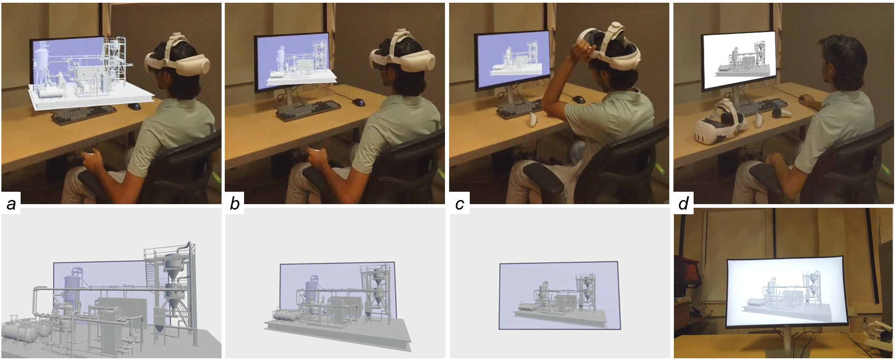

# *SeamlessVR*

*SeamlessVR* is a novel method that smoothly transitions a user’s view from an immersive VR headset to a non-immersive on-screen display. During headset removal, *SeamlessVR* continuously morphs the 3D visualization into 2D, matching what users will see on their monitor. This transition reduces cognitive overhead and allows users to continue visualization tasks seamlessly on screen.

---

## Requirements

- **Windows 11**  
- **Oculus Quest 2/3/3S/Pro**  
- **Unity 2022.3.17f1** (or newer)  
- **Meta XR All-in-One SDK (v68.0.0)**  

---

## Project Setup

This repository contains **two** applications:

1. **Client**  
   - Located in the `seamless_vr_client` folder.  
   - Runs on the PC, rendered in the headset through PC Link.

2. **Server**  
   - Located in the `seamless_vr_server` folder.  
   - Runs on the PC.

### Building & Running

1. **Build the Client**  
   - Open the `seamless_vr_client` project in Unity.  
   - Use Windows build configuration for the VR headset.  
   - Ensure the **Meta XR All-in-One SDK** is installed.  
   - Build the `UserStudyScene.unity` located in the `Scenes` folder.

2. **Build the Server**  
   - Open the `seamless_vr_server` project in Unity.  
   - Use Windows build configuration.
   - Build the `ServerScene.unity` located in the `Scenes` folder.  

3. **Connect the Headset & PC**  
   - Start the **server** on the PC.  
   - Launch the **client** on the headset.  
   - The two applications communicate via the PC Link plugin.

---

## Credits

- See the [LICENSE](LICENSE) file for copyright and licensing details.
- If you use **SeamlessVR** in a publication, please cite the corresponding paper:

> **“SeamlessVR: Bridging the Immersive to Non-Immersive Visualization Divide”**

For questions or feedback, please [open an issue](../../issues) or contact the authors.

---

*Thank you for exploring SeamlessVR!*
